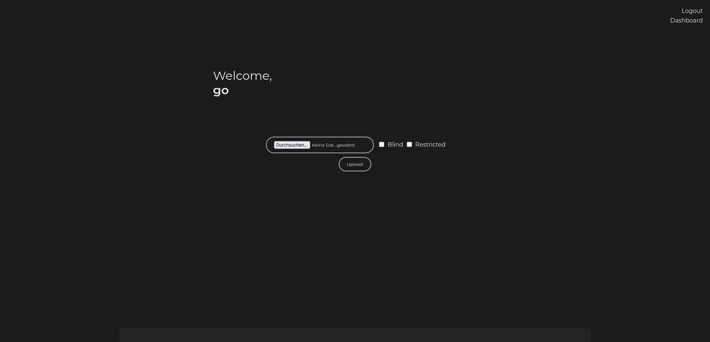
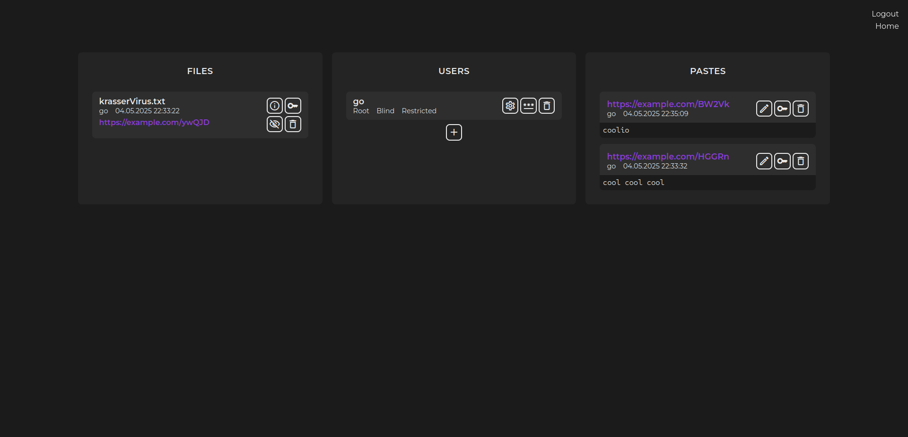

## GoUpload

Upload and host files and text. Comes with file, user and permission management. Files and texts can be either public or only visible to users. Undocumented personal projected, use [file browser](https://github.com/filebrowser/filebrowser) instead.

# Host it
- copy `config/config.yml.sample` to `config/config.yml`
- configure the config
- use `config/goupload.sql` to create the database
- configure `docker-compose.yml`
- `docker compose up`
